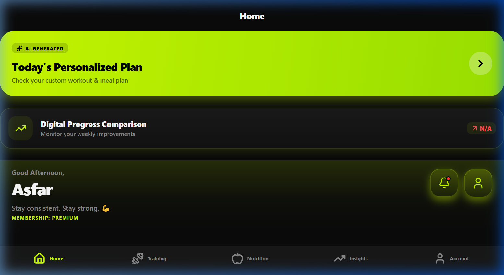
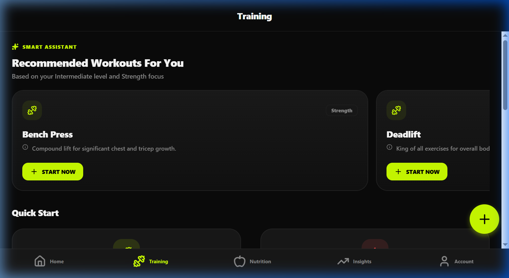
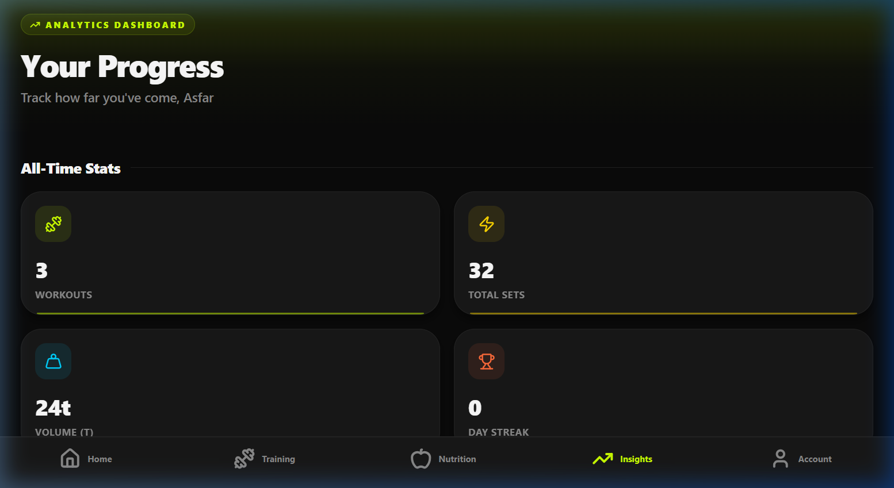

# <p align="center">🚀 Fitness Tracker Pro</p>
<p align="center"><b>The Ultimate AI-Powered Wellness Ecosystem for the Modern Athlete</b></p>

<p align="center">
  
</p>

<p align="center">
  <a href="https://github.com/A4Asfar/Fitness-Tracking-and-Workout-management-system"></a>
  <a href="https://github.com/A4Asfar/Fitness-Tracking-and-Workout-management-system"></a>
  <a href="https://github.com/A4Asfar/Fitness-Tracking-and-Workout-management-system"></a>
</p>

---

## 📸 Experience the Interface

<div align="center">
  <table>
    <tr>
      <td align="center">
        <br/>
        <b>✨ Aesthetic Dashboard</b>
      </td>
      <td align="center">
        <br/>
        <b>⚡ Training Hub</b>
      </td>
      <td align="center">
        <br/>
        <b>📊 Precision Analytics</b>
      </td>
    </tr>
  </table>
</div>

---

## 💎 Core Capabilities

### 🧠 AI Intelligence Layer
*   **Neural Coaching**: Get daily workout and nutrition blueprints tailored to your specific biomechanics.
*   **Smart Assistant**: A real-time AI expert integrated into your dashboard for form and diet guidance.
*   **Predictive Metrics**: Intelligent intensity scoring and recovery trends calculated from your performance.

### 🏋️ Elite Training System
*   **Interactive Checklists**: Follow professional programs with real-time rep tracking and progress bars.
*   **High-Speed Logging**: A streamlined interface for entering sets, reps, and weights in seconds.
*   **Volume Analytics**: Beautifully visualized strength trends and weekly performance summaries.

### 🥗 Culinary Architecture
*   **Macro-Nutrition**: Precise tracking of protein, fats, and carbs for every meal.
*   **Goal-Driven Recipes**: Specialized recommendations for cutting, bulking, or maintaining.

---

## 🛠️ Technical Masterpiece

<div align="center">
  <table>
    <tr>
      <td align="center"></td>
      <td align="center"></td>
      <td align="center"></td>
    </tr>
    <tr>
      <td align="center"></td>
      <td align="center"></td>
      <td align="center"></td>
    </tr>
  </table>
</div>

---

## 🏁 Swift Installation

### 1️⃣ Clone the Ecosystem
```bash
git clone https://github.com/A4Asfar/Fitness-Tracking-and-Workout-management-system.git
cd Fitness-Tracking-and-Workout-management-system
```

### 2️⃣ Ignite the Backend
```bash
cd backend
npm install
npm start # Server starts at http://localhost:5000
```

### 3️⃣ Launch the Interface
```bash
cd frontend
npm install
npx expo start # Scan QR code with Expo Go
```

---

<p align="center">
  <b>Built for the Elite. Developed for the Modern Athlete.</b><br/>
  
</p>
