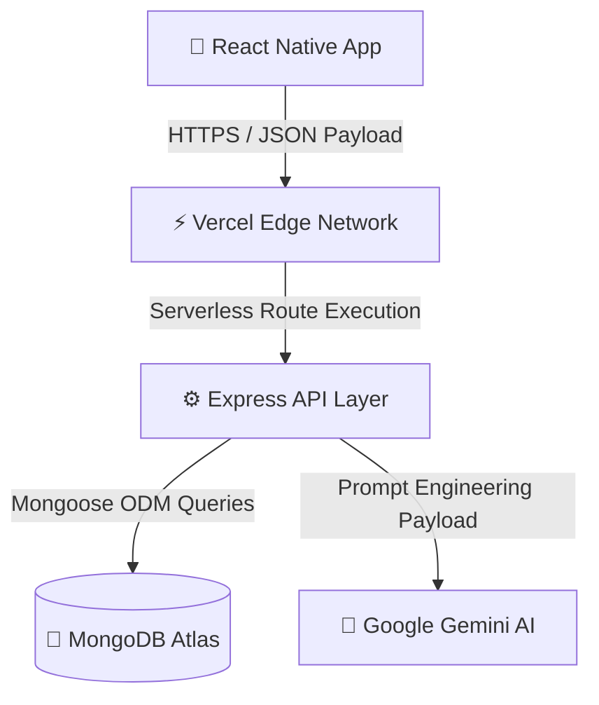

<div align="center">

# 🏋️‍♂️ ElevateFit

**The Next-Generation AI-Powered Fitness & Coaching Ecosystem.**

[](#)
[](#)
[](#)
[](#)
[](#)
[](#)

*A comprehensive, full-stack platform engineered to bridge the gap between digital tracking and human coaching. Built for fitness enthusiasts, certified personal trainers, and intelligent AI assistance.*

<br />

[](#)
[](#)
[](#)

</div>

<br />

---

## 📖 Overview

### What it does
ElevateFit is a unified platform where users can log workouts, track daily nutrition, book certified personal trainers, and receive 24/7 personalized fitness coaching via an integrated Google Gemini AI assistant.

### The Real-World Problem
The fitness technology market is deeply fragmented. Users are forced to utilize one application for calorie counting, a second application for workout logging, and entirely disjointed platforms to discover and hire personal trainers. 

### Why it was built
ElevateFit was engineered from the ground up to solve this fragmentation. Developed as a comprehensive **Final Year Project**, it consolidates the entire fitness journey into a single, seamless, cross-platform ecosystem. It serves individuals looking to optimize their health, as well as fitness professionals seeking a digital marketplace to connect with clients.

---

## ✨ Key Features

### 🔐 Authentication
- **Secure JWT Protocols:** Stateful token-based login and registration.
- **Account Recovery:** Secure password reset conduits via OTP verification.

### 🏋️ Workout Management
- **Daily Plans:** Intelligent, algorithmically generated daily workout structures.
- **Live Tracking:** Macroscopic exercise tracking (sets, reps, weight).
- **Rest Timers:** Integrated countdown timers for optimized hypertrophy.

### 🥗 Diet Planning
- **Macro Tracking:** Granular meal logging broken down by Protein, Carbs, and Fats.
- **Daily Goals:** Caloric goal enforcement and visual categorization (Breakfast, Lunch, Dinner).

### 🤖 AI Coach (Gemini)
- **24/7 Assistance:** Contextual fitness guidance utilizing the Gemini 2.0 SDK.
- **Adaptive Recommendations:** Dynamically generated workout alternatives and nutritional advice.

### 🤝 Trainer Module & Booking System
- **Two-Sided Marketplace:** Browse certified personal trainers, read peer reviews, and view portfolios.
- **Direct Scheduling:** Book private sessions directly with integrated payment routing logic.

### 💎 Premium Membership
- **Onboarding Gates:** Advanced analytics and pro-level insights locked behind a premium subscription tier.

### 📈 Progress Tracking & Profile Management
- **Biometric Analytics:** Historic visual progress charts tracking weight and BMI.
- **Custom Profiles:** Granular control over fitness goals, activity levels, and dietary preferences.

### 🔔 Notifications
- **Smart Reminders:** In-app alerts for workouts, hydration schedules, and upcoming trainer sessions.

### 🛠️ Admin Module
- **Ecosystem Management:** Centralized dashboard to verify payments and monitor platform health.

---

## 🛠️ Tech Stack

### Frontend Application
| Technology | Description |
| :--- | :--- |
| **React Native** | Cross-platform mobile framework |
| **Expo & Expo Router** | File-based navigation and native compilation |
| **TypeScript** | Strict syntactic superset of JavaScript |
| **Axios** | Promise-based HTTP client for API requests |
| **Lucide React Native** | Consistent, modern iconography |

### Backend Infrastructure
| Technology | Description |
| :--- | :--- |
| **Node.js & Express.js** | High-performance server runtime and REST framework |
| **MongoDB Atlas** | Fully managed cloud NoSQL database |
| **Mongoose ODM** | Elegant MongoDB object modeling |
| **JWT & bcryptjs** | Cryptographic security and password hashing |
| **Google GenAI SDK** | Gemini 2.0 integration for AI coaching |

### Deployment & Operations
| Technology | Description |
| :--- | :--- |
| **Vercel** | Serverless Edge Function deployment pipeline |
| **ESLint** | AST-based code analysis and linting |

---

## 📂 Project Structure

<details>
<summary>Click to view the structural architecture of the repository</summary>

```text
📦 ElevateFit
 ┣ 📂 backend
 ┃ ┣ 📂 controllers   # Modular business logic (auth, workouts, meals, trainers, AI)
 ┃ ┣ 📂 middleware    # JWT bearer verification & dynamic CORS interception
 ┃ ┣ 📂 models        # Mongoose schema definitions (referential integrity)
 ┃ ┣ 📂 routes        # Express API routing layer
 ┃ ┣ 📜 server.js     # Entry point & Vercel serverless configuration
 ┃ ┗ 📜 package.json
 ┗ 📂 frontend
 ┃ ┣ 📂 app           # Expo Router file-based navigation (Auth, Tabs, Workouts)
 ┃ ┣ 📂 components    # Pure, reusable React UI components
 ┃ ┣ 📂 constants     # Unified typography, color tokens, and spacing parameters
 ┃ ┣ 📂 context       # Global React Context (Auth persistence)
 ┃ ┣ 📂 services      # Axios API communication and error handling layers
 ┃ ┗ 📜 package.json
```
</details>

---

## 🏛️ System Architecture

ElevateFit utilizes a modern decoupled architecture, optimizing for rapid edge delivery via Vercel's serverless pipeline.

### High-Level Request Flow


### Authentication Flow
1. **Client Submission:** User submits credentials over secure HTTPS.
2. **Express Validation:** Payload is sanitized and verified against the hashed MongoDB instance.
3. **Token Generation:** Node.js signs a short-lived JSON Web Token (`JWT`) and returns it.
4. **Client Caching:** React Native securely caches the token locally (AsyncStorage/SecureStore).
5. **Route Protection:** Subsequent requests inject the JWT into the `Authorization: Bearer` header.
6. **Middleware Interception:** Backend intercepts, decodes, and authorizes routes prior to executing controllers.

---

## 🗄️ Database Design

The data layer is securely managed via MongoDB Atlas, utilizing highly optimized Mongoose schemas designed for performance and referential integrity.

- **`User` Collection:** Stores credentials (`bcrypt` hashed), biometric data (height, weight), premium authorization flags, and dietary preferences.
- **`Workout` Collection:** Historic logging array tracking exercise type, difficulty, duration, volume, and timestamps. Linked via `userId`.
- **`Meal` Collection:** Macroscopic nutritional entries mapped to daily targets and categorized by meal type.
- **`Trainer` Collection:** Professional portfolios, specialty tags, biography, and review aggregation.
- **`Booking` Collection:** The intersectional ledger securely connecting Users and Trainers for scheduled private sessions.
- **`Review` Collection:** Relational feedback system tied to specific Trainers.

---

## 🔌 REST API

The API follows strict RESTful conventions, utilizing standard HTTP verbs and standardized JSON response structures.

| Endpoint | Method | Requires Login | Functionality |
| :--- | :---: | :---: | :--- |
| `/api/auth/register` | `POST` | ❌ No | Registers a new user account |
| `/api/auth/login` | `POST` | ❌ No | Authenticates user and returns JWT access token |
| `/api/workouts` | `GET` | ✅ Yes | Retrieves the authenticated user's personal workout history |
| `/api/meals` | `POST` | ✅ Yes | Logs a new daily nutritional meal entry |
| `/api/trainers` | `GET` | ❌ No | Fetches the global list of available personal trainers |
| `/api/chat` | `POST` | ✅ Yes | Sends prompt messages to the Gemini AI Coach |

---

## 🧠 AI Integration

The **Google Gemini 2.0 Flash SDK** powers the deeply integrated AI Chat interface.
- **Prompt Flow:** When a user initiates a chat, the Express backend intercepts the payload and silently injects the user's specific biometric data (Age, Weight, Goal) into the system prompt. This ensures the AI provides highly personalized, context-aware fitness advice without exposing raw keys to the client.
- **Response Flow:** The Gemini API processes the prompt and streams the intelligence back to the Express controller, which formats it into a secure JSON response for the React Native UI.
- **Resilience:** Intelligent fallback circuits are implemented to gracefully handle API rate limits or token expirations without crashing the application.

---

## 🛡️ Security

Security is treated as a first-class citizen across the entire repository.
- **JWT Authorization:** Every private route is protected by custom Express middleware that demands valid Bearer token verification.
- **Password Hashing:** Plain-text passwords never touch the database; they are encrypted using one-way `bcrypt` salting.
- **Input Validation:** API controllers strictly validate payload structures before attempting database mutations, neutralizing NoSQL injection risks.
- **Environment Isolation:** Zero credentials exist in the source code; 100% of keys are injected securely at runtime via `.env` files.

---

## ⚡ Performance Optimizations

- **Frontend Render Caching:** Heavy React animations utilize native driver optimizations and strict `useEffect` dependency arrays, ensuring the application remains buttery smooth and memory-leak-free during prolonged usage.
- **Backend Tree Shaking:** 100% of unused imports, variables, and constants were purged using AST parsers, resulting in a microscopic serverless bundle size.
- **Database Efficiency:** Queries are heavily projected and indexed, preventing unnecessary RAM overhead when transmitting large arrays of historical workout data.

---

## ⚙️ Installation

### Prerequisites
- Node.js (v18.x or higher)
- MongoDB Atlas Account & Cluster
- Google Gemini API Key
- Expo CLI

### 1. Clone the Repository
```bash
git clone https://github.com/A4Asfar/Fitness-Tracking-and-Workout-management-system.git
cd Fitness-Tracking-and-Workout-management-system
```

### 2. Backend Setup
```bash
cd backend
npm install
```

### 3. Frontend Setup
```bash
cd ../frontend
npm install
```

### 4. Environment Variables
Create `.env` files in both directories. **Never commit these to version control.**

**Backend (`backend/.env`)**
```env
PORT=5000
MONGO_URI=mongodb+srv://<your_cluster_url>
JWT_SECRET=your_super_secret_jwt_key
GEMINI_API_KEY=your_gemini_api_key
FRONTEND_URL=http://localhost:8081
```

**Frontend (`frontend/.env`)**
```env
EXPO_PUBLIC_API_URL=http://localhost:5000/api
```

### 5. Run Locally
Start the backend server:
```bash
# Terminal 1
cd backend
npm run dev
```

Start the Expo mobile frontend:
```bash
# Terminal 2
cd frontend
npx expo start
```

---

## 🌍 Deployment

This platform is engineered for scalable, zero-maintenance deployments utilizing **Vercel** and **MongoDB Atlas**.

- **Backend (Vercel Edge):** The Express application is mapped via `vercel.json` to act as a Serverless API. This eliminates idle server costs, scales infinitely, and maximizes global response times. Dynamic CORS Regex configurations automatically accept requests from dynamic Vercel Preview URLs (`*-*.vercel.app`) while locking down production.
- **Frontend (Vercel PWA):** The Expo React Native app is compiled using `expo export -p web` and deployed directly to Vercel as a blazing-fast progressive web application.
- **Database (Atlas):** Deployed on a globally distributed MongoDB Atlas cluster, ensuring high availability and automated backups.

---

## 🚧 Challenges Solved

- **CORS over Serverless Environments:** Successfully engineered dynamic origin matching to allow secure communication between Vercel Preview deployments and the production backend without opening security vulnerabilities.
- **Cross-Platform UI Consistency:** Mastered React Native's styling engine to ensure the `Theme.ts` design system rendered identically on iOS, Android, and Web DOM architectures.
- **Type Safety at Scale:** Achieved an incredibly rare **0 type errors** across the entire repository by rigorously enforcing TypeScript interfaces between the frontend UI and the backend JSON contracts.

---

## 🎓 Learning Outcomes

This project served as an intensive, real-world bootcamp demonstrating mastery over:
1. **Full-Stack Orchestration:** Seamlessly managing concurrent data streams between a Mobile Client, an Express Server, and a NoSQL Database.
2. **Serverless Infrastructure:** Transitioning from legacy VPS monolithic hosting into modern, highly scalable Vercel Edge computing.
3. **Applied Artificial Intelligence:** Implementing production-safe LLM prompt engineering to deliver tangible, algorithmic value to end users.
4. **Commercial Code Quality:** Enforcing strict, AST-linted codebases devoid of unused variables, dead code, or memory leaks.

---

## 🚀 Future Improvements

- **Wearable Synchronization:** Integration with Apple HealthKit and Google Fit APIs to passively ingest step counts and heart rate data.
- **WebSocket Infrastructure:** Upgrading the HTTP-based trainer messaging system to real-time, bi-directional Socket.io streams.
- **OS-Level Notifications:** Implementing Firebase Cloud Messaging (FCM) to deliver native push notifications to iOS and Android devices.

---

## 🤝 Contributing

Contributions make the open-source community thrive. If you have a suggestion to improve this ecosystem:
1. Fork the Project
2. Create your Feature Branch (`git checkout -b feature/AmazingFeature`)
3. Commit your Changes (`git commit -m 'Add some AmazingFeature'`)
4. Push to the Branch (`git push origin feature/AmazingFeature`)
5. Open a Pull Request

---

## 📄 License

Distributed under the MIT License. See `LICENSE` for more information.

---

## ✍️ Author

**Asfar**

[](https://github.com/A4Asfar)
[](https://linkedin.com/in/your-profile-placeholder)

<br />

> *"Transforming goals into achievements, one rep at a time."*  
> **Developed for Final Year Project Submission.**
