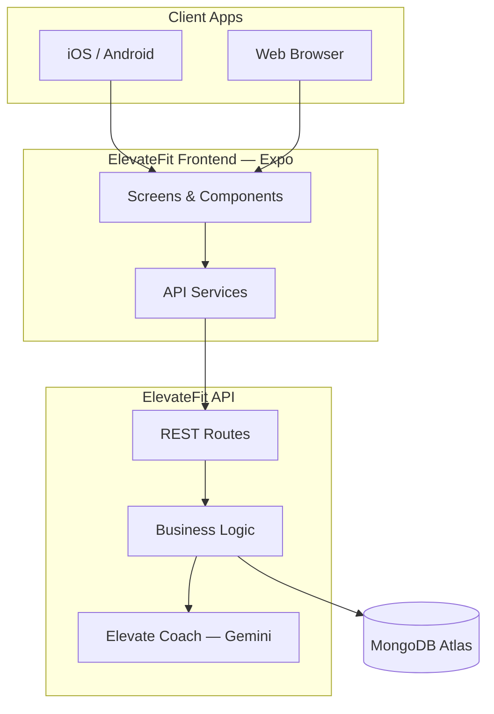

<div align="center">

# ElevateFit

### Modern AI Fitness & Coaching Platform

**Personalized coaching. Certified trainers. One seamless experience.**


[](https://ai.google.dev/)
[](https://expo.dev/)
[](https://github.com/A4Asfar/Fitness-Tracking-and-Workout-management-system)

[Live Demo](#-live-demo) · [Features](#-platform-overview) · [For Businesses](#-built-for-modern-fitness-businesses) · [Get Started](#-quick-start) · [Contact](#-contact--partnerships)

</div>

---

## Overview

**ElevateFit** is a full-stack fitness platform designed for **gyms, personal trainers, wellness startups, and health-focused businesses** that need a polished, production-ready digital product — not a prototype.

Combining **Elevate Coach** (AI-powered personal training), a **certified trainer marketplace**, and **end-to-end member management**, ElevateFit delivers the kind of experience clients expect from premium fitness brands in 2026.

> Train smarter. Book experts. Track everything. Scale your business.

---

## Built for Modern Fitness Businesses

Whether you are launching a fitness app, digitizing your gym, or offering AI coaching as a service — ElevateFit gives you a complete foundation.

| Audience | What You Get |
|----------|--------------|
| **Gym & Studio Owners** | Member dashboards, trainer booking, premium tiers, admin controls |
| **Personal Trainers** | Profile pages, session booking, reviews, and client progress visibility |
| **Fitness Startups** | Production MERN stack, AI coach, mobile + web from day one |
| **Agencies & Developers** | Clean codebase, easy white-labeling |

---

## Platform Overview

### Elevate Coach — AI Personal Trainer
Your 24/7 intelligent coaching assistant powered by Google Gemini.

- Custom workout plans (warm-up, exercises, cool-down, coaching cues)
- Personalized nutrition & macro guidance
- Smart chat with conversation memory
- Enterprise-grade AI failover & reliability

### Trainer Marketplace
Connect members with certified professionals.

- **80+ coaches** with HD profile photos
- Search by specialty, city, rating, and availability
- Online & in-person session booking
- Verified reviews after completed sessions

### Member App Experience
Everything your clients need in one place.

- Home dashboard — BMI, activity score, weekly insights
- Workout & nutrition logging
- Weight, steps, and body health tracking
- Daily AI-generated training & meal plans
- Premium membership with secure upgrade flow

### Admin & Business Tools
Run your platform with confidence.

- User & role management
- Booking & payment verification
- Premium subscription approval workflow
- Configurable pricing & system settings

---

## Why Clients Choose ElevateFit

```
┌─────────────────────────────────────────────────────────────────┐
│  ELEVATE COACH AI    +    TRAINER NETWORK    +    ANALYTICS     │
│         ↓                        ↓                      ↓         │
│   Personalized plans      Expert sessions        Measurable ROI   │
└─────────────────────────────────────────────────────────────────┘
```

| Capability | Benefit |
|------------|---------|
| Cross-platform (iOS, Android, Web) | Reach every client, everywhere |
| AI + human coaches | Best of automation and personal touch |
| Premium membership system | Monetize from day one |
| Secure authentication | Enterprise-ready JWT & encrypted passwords |
| Cloud-native architecture | Ready for your own hosting platform |

---

## Live Demo

| Service | Link |
|---------|------|
| **Production API** | Configure your own hosting |
| **Health Check** | `GET /` → `{ "status": "online", "message": "ElevateFit API is running smoothly" }` |

| **Mobile** | Expo Go — run locally with `npm run dev` |

---

## Tech Stack

| Layer | Technology |
|:------|:-----------|
| **Frontend** | React Native · Expo 54 · TypeScript · Expo Router |
| **Backend** | Node.js · Express 5 · REST API |
| **Database** | MongoDB · Mongoose ODM |
| **AI Engine** | Google Gemini (multi-model failover) |
| **Authentication** | JWT · bcrypt · OTP email reset |
| **Database** | MongoDB Atlas |

---

## Architecture



---

## Project Structure

```
elevatefit/
├── frontend/                 # Expo app — iOS, Android, Web
│   ├── app/                  # Screens & navigation
│   ├── components/           # Reusable UI
│   ├── constants/Brand.ts    # ← App branding
│   └── services/             # API integration
├── backend/                  # Express REST API
│   ├── controllers/          # Core business logic
│   ├── models/               # Database schemas
│   ├── routes/               # API endpoints
│   └── constants/brand.js    # ← Backend branding
├── .agents/                  # Elevate Coach AI persona
└── README.md
```

---

## Quick Start

### Prerequisites
- Node.js 18+
- MongoDB Atlas account (or local MongoDB)
- Google Gemini API key

### 1. Clone the repository

```bash
git clone https://github.com/A4Asfar/Fitness-Tracking-and-Workout-management-system.git
cd Fitness-Tracking-and-Workout-management-system
```

### 2. Install dependencies

```bash
cd backend && npm install
cd ../frontend && npm install
```

### 3. Configure environment

**Backend** — create `backend/.env`:

```env
MONGO_URI=your_mongodb_connection_string
JWT_SECRET=your_secure_jwt_secret
GEMINI_API_KEY=your_gemini_api_key
EMAIL_USER=your_email@gmail.com
EMAIL_PASS=your_gmail_app_password
PORT=5000
```

**Frontend** — create `frontend/.env`:

```env
EXPO_PUBLIC_API_URL=http://localhost:5000/api
```

> Copy from `.env.example` files included in each folder.

### 4. Seed trainers & launch

```bash
# Terminal 1 — API Server
cd backend
npm run seed:trainers
npm run dev

# Terminal 2 — Mobile / Web App
cd frontend
npm run dev
```

---

## Deployment

### Deployment

Choose your preferred hosting provider for the Node.js backend. Simply provide the `.env` variables from `backend/.env.example` to your platform.

---

## Brand & Customization

ElevateFit is designed to be **white-label ready**. Update your brand in two files:

| File | Controls |
|------|----------|
| [`frontend/constants/Brand.ts`](frontend/constants/Brand.ts) | App name, AI coach name, support email, UI labels |
| [`backend/constants/brand.js`](backend/constants/brand.js) | API messages, emails, system defaults |

**Default configuration:**

| Setting | Value |
|---------|-------|
| App Name | **ElevateFit** |
| AI Coach | **Elevate Coach** |
| Pro Tier | **ElevateFit Pro** |
| Support | support@elevatefit.com |

---

## API Reference

| Module | Key Endpoints |
|--------|---------------|
| **Auth** | `POST /api/auth/register` · `/login` · `/forgot-password` |
| **Profile** | `GET/PUT /api/profile` · `/analytics` |
| **Workouts** | `CRUD /api/workouts` · `/analytics` · `/home-insights` |
| **AI Chat** | `POST /api/chat` · conversation management |
| **Trainers** | `GET /api/content/trainers` · `POST /api/bookings` |
| **Premium** | `POST /api/premium/purchase` · `GET /api/premium/my` |
| **Admin** | `/api/admin/stats` · users · bookings · payments |

---

## Security & Compliance

- Passwords hashed with **bcrypt** (10 salt rounds)
- **JWT** stateless authentication on all protected routes
- Role-based **admin access control**
- CORS locked to approved origins (Expo)
- Environment secrets never committed to source control
- Input validation on every controller

---

## Roadmap

- [ ] Automated payments (Stripe / JazzCash / EasyPaisa)
- [ ] Push notifications for workouts & bookings
- [ ] Apple HealthKit & Google Fit integration
- [ ] Multi-tenant white-label portals
- [ ] Urdu / English localization

---

## License

Distributed under the **ISC License**.

---

## Contact & Partnerships

Interested in **ElevateFit** for your gym, coaching business, or startup?

| | |
|---|---|
| **Product** | ElevateFit — Modern AI Fitness & Coaching Platform |
| **Support** | support@elevatefit.com |
| **Repository** | [github.com/A4Asfar/Fitness-Tracking-and-Workout-management-system](https://github.com/A4Asfar/Fitness-Tracking-and-Workout-management-system) |
| **Live API** | Needs Deployment |

*For demos, custom development, or deployment assistance — open a GitHub issue or reach out directly.*

---

<div align="center">

**ElevateFit** — *Elevate your fitness business.*

© 2026 ElevateFit. All rights reserved.

</div>
