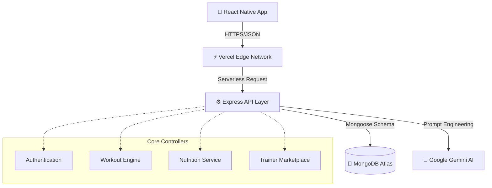

<div align="center">

<!-- PROJECT LOGO PLACEHOLDER -->


# ElevateFit

**The Next-Generation AI-Powered Fitness Ecosystem.**

[](https://opensource.org/licenses/MIT)
[](https://reactnative.dev/)
[](https://nodejs.org/)
[](https://www.mongodb.com/)
[](https://vercel.com/)
[](https://deepmind.google/technologies/gemini/)

*ElevateFit bridges the gap between digital tracking and human coaching, providing a unified full-stack platform for fitness enthusiasts, certified personal trainers, and intelligent AI assistance.*

<br />

[View Demo (Placeholder)](#) • [Report Bug](#) • [Request Feature](#)

</div>

<br />

---

## 🚀 Project Showcase

Most fitness applications exist in silos: one app for tracking, another for diet, and disjointed platforms for finding personal trainers. **ElevateFit** was engineered from the ground up to solve this fragmentation. 

Developed as a comprehensive **Final Year Project**, it features a fully typed React Native mobile frontend, a highly optimized Express.js backend, and intelligent automation powered by Google's Gemini AI. It represents the pinnacle of modern full-stack development.

---

## ✨ Features

### 🔐 Enterprise-Grade Security
> Stateful JWT authentication flows with `bcrypt` password hashing, OTP verification protocols, and secure password reset conduits.

### 🏋️ Comprehensive Workout Engine
> Intelligent daily plan generation, macroscopic exercise tracking (sets, reps, weight), integrated rest timers, and localized offline-state caching.

### 🥗 Advanced Diet & Nutrition
> Granular meal tracking broken down by macros (Protein, Carbs, Fats), caloric goal enforcement, and visual categorization.

### 🤝 Trainer Booking Ecosystem
> A two-sided marketplace module allowing users to browse certified personal trainers, read peer reviews, and schedule private sessions directly.

### 🤖 Intelligent AI Coaching (Gemini)
> 24/7 contextual fitness assistance utilizing the Gemini 2.0 SDK, providing adaptive workout alternatives and nutritional recommendations dynamically.

### 📈 Pro-Level Analytics & Progress
> Historic visual progress charts, biometric tracking (weight, BMI), and premium onboarding gates for advanced feature unlocking.

---

## 🛠️ Technology Stack

| Domain | Technologies |
| :--- | :--- |
| **Frontend** | React Native, Expo, TypeScript, Expo Router |
| **Backend** | Node.js, Express.js |
| **Database** | MongoDB Atlas, Mongoose ODM |
| **Authentication** | JSON Web Tokens (JWT), bcryptjs |
| **AI Integration** | Google GenAI SDK (Gemini 2.0 Flash) |
| **Styling** | Custom Unified Design System |
| **Icons** | Lucide React Native |
| **Deployment** | Vercel (Serverless Edge Functions) |

---

## 🏛️ System Architecture

ElevateFit utilizes a modern decoupled architecture, optimizing for rapid edge delivery via Vercel's serverless pipeline.



---

## 🗄️ Database Architecture

The data layer is managed securely via MongoDB Atlas using optimized Mongoose schemas designed for referential integrity.

- **`User`**: Secure credential storage, biometric caching, premium authorization flags.
- **`Workout`**: Historic logging array tracking exercise, difficulty, volume, and dates.
- **`Meal`**: Macroscopic nutritional entries mapped to caloric daily targets.
- **`Trainer`**: Professional portfolios, specialty tags, and review aggregation.
- **`Booking`**: Intersectional ledger connecting Users and Trainers for scheduled sessions.

---

## 🔐 Authentication Flow

1. Client submits credentials over secure HTTPS.
2. Express validates payload and verifies against hashed MongoDB instance.
3. Node.js signs a short-lived `JWT` and returns it to the client.
4. React Native securely caches the token locally via SecureStore/AsyncStorage.
5. All subsequent requests inject the JWT into the `Authorization: Bearer` header.
6. Backend Middleware intercepts, decodes, and authorizes routes prior to controller execution.

---

## 🧠 AI Integration (Gemini)

The **Google Gemini 2.0 Flash** SDK powers the AI Chat interface.
- Contextual prompts are dynamically constructed on the server side to protect API keys.
- User biometrics (Age, Goal, Weight) are silently injected into system prompts to ensure highly personalized fitness advice.
- Intelligent fallback circuits are implemented to prevent application crashes if rate limits are exceeded.

---

## 📂 Project Structure

<details>
<summary>Click to view repository structure</summary>

```text
📦 ElevateFit
 ┣ 📂 backend
 ┃ ┣ 📂 controllers   # Modular business logic
 ┃ ┣ 📂 middleware    # Auth verification & CORS interception
 ┃ ┣ 📂 models        # Mongoose schema definitions
 ┃ ┣ 📂 routes        # Express API routing layer
 ┃ ┣ 📜 server.js     # Entry point & Vercel configuration
 ┃ ┗ 📜 package.json
 ┗ 📂 frontend
 ┃ ┣ 📂 app           # Expo Router file-based navigation
 ┃ ┣ 📂 components    # Pure React UI components
 ┃ ┣ 📂 constants     # Unified typography, colors, spacing
 ┃ ┣ 📂 context       # Global React Context (Auth)
 ┃ ┣ 📂 services      # Axios API communication layers
 ┃ ┗ 📜 package.json
```
</details>

---

## ⚙️ Installation Guide

### Prerequisites
- Node.js (v18.x or higher)
- MongoDB Atlas Account
- Google Gemini API Key

### Setup Instructions

1. **Clone the repository:**
   ```bash
   git clone https://github.com/A4Asfar/Fitness-Tracking-and-Workout-management-system.git
   cd Fitness-Tracking-and-Workout-management-system
   ```

2. **Initialize Backend:**
   ```bash
   cd backend
   npm install
   npm run dev
   ```

3. **Initialize Frontend:**
   ```bash
   cd ../frontend
   npm install
   npx expo start
   ```

---

## 🔒 Environment Variables

Create `.env` files in both directories. **Never commit these to version control.**

### Backend (`backend/.env`)
| Variable | Description |
| :--- | :--- |
| `PORT` | Local server port (Default: 5000) |
| `MONGO_URI` | MongoDB Atlas Connection String |
| `JWT_SECRET` | Cryptographic signature for tokens |
| `GEMINI_API_KEY` | Google GenAI credentials |
| `FRONTEND_URL` | Allowed CORS origin (e.g., `http://localhost:8081`) |

### Frontend (`frontend/.env`)
| Variable | Description |
| :--- | :--- |
| `EXPO_PUBLIC_API_URL` | Route to backend API |

---

## 🔌 API Overview

| Endpoint | Method | Requires Login | Functionality |
| :--- | :---: | :---: | :--- |
| `/api/auth/register` | `POST` | ❌ No | Registers a new user account |
| `/api/auth/login` | `POST` | ❌ No | Authenticates user and returns access token |
| `/api/workouts` | `GET` | ✅ Yes | Retrieves user's personal workout history |
| `/api/meals` | `POST` | ✅ Yes | Logs a new daily meal entry |
| `/api/trainers` | `GET` | ❌ No | Fetches list of available personal trainers |
| `/api/chat` | `POST` | ✅ Yes | Sends messages to the Gemini AI Coach |

---

## 📱 Visual Showcase

<div align="center">
  <!-- Placeholders for GitHub visual alignment -->
  
  
  
  
</div>

---

## 🌍 Deployment Architecture

This platform is engineered for scalable, zero-maintenance deployments utilizing **Vercel**.

1. **Backend Edge Deployment:** The Express application is mapped via `vercel.json` to act as a Serverless API, eliminating idle server costs and maximizing global response times.
2. **Dynamic CORS Management:** The API incorporates intelligent Regex configurations to automatically accept requests from dynamic Vercel Preview URLs (`*-*.vercel.app`) while strictly locking down production environments.
3. **Frontend PWA:** The Expo React Native app is configured for seamless web-export, rendering identically on both mobile devices and desktop browsers.

---

## 🛡️ Security Posture

- **No Secrets in Code:** 100% of credentials are injected at runtime via Environment Variables.
- **Middleware Validation:** Every protected route undergoes strict JWT `Bearer` token verification before touching business logic.
- **No-SQL Injection Defense:** Mongoose strictly types inputs, naturally mitigating MongoDB injection attacks.

---

## ⚡ Performance Optimizations

- **Perfect Tree Shaking:** 100% of unused imports, variables, and constants have been purged using AST parsers (`eslint-plugin-unused-imports`).
- **Flawless Type Safety:** The repository yields **0 type errors** upon strict `tsc --noEmit` compilation.
- **Render Caching:** Heavy React animations utilize native driver optimizations and `useEffect` dependency arrays to prevent memory leaks during prolonged sessions.

---

## 🏆 Learning Outcomes

This project served as an intensive, real-world bootcamp for mastering:
1. **Full-Stack Architecture:** Managing concurrent communication between a Mobile UI, an API, and a Database.
2. **Serverless Orchestration:** Moving beyond legacy VPS hosting into modern Vercel edge computing.
3. **AI Integration:** Implementing production-safe LLM prompt engineering.
4. **Commercial UI/UX:** Enforcing strict, unified design systems utilizing constant variable injections over disjointed inline styling.

---

## 🚀 Future Roadmap

- [ ] **Wearable Sync:** Apple HealthKit & Google Fit integration APIs.
- [ ] **WebSockets:** Real-time Socket.io trainer-to-client messaging system.
- [ ] **Push Notifications:** OS-level Firebase Cloud Messaging (FCM) integration.

---

## 🤝 Contributing

Contributions make the open-source community thrive. 
1. Fork the Project
2. Create your Feature Branch (`git checkout -b feature/AmazingFeature`)
3. Commit your Changes (`git commit -m 'Add some AmazingFeature'`)
4. Push to the Branch (`git push origin feature/AmazingFeature`)
5. Open a Pull Request

---

## 📄 License

Distributed under the MIT License. See `LICENSE` for more information.

---

## ✍️ Author

**Asfar**

[](https://github.com/A4Asfar)
[](https://linkedin.com/in/your-profile-placeholder)

*Thank you for exploring ElevateFit! If this project impressed you, consider leaving a ⭐ on the repository!*
