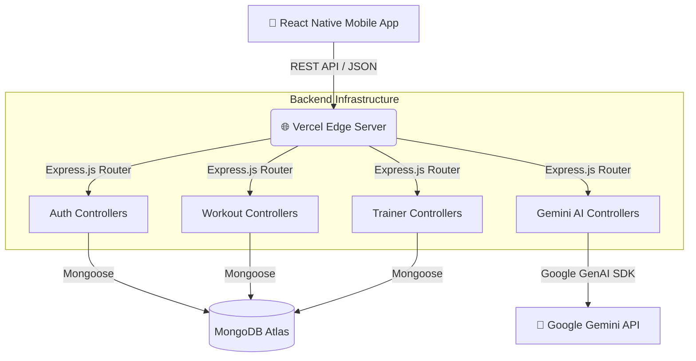

<div align="center">
  
  # 🏋️‍♂️ ElevateFit
  ### AI-Powered Fitness Tracking & Workout Management System
  
  <p align="center">
    A comprehensive, full-stack fitness ecosystem connecting users, trainers, and AI-driven coaching. Built with React Native, Node.js, Express, and MongoDB.
  </p>

  <p align="center">
    
    
    
    
    
    
    
    
  </p>
</div>

---

## 📖 Project Overview

**ElevateFit** is a world-class, commercial-grade fitness platform developed as a Final Year Project (FYP). 

It solves the real-world problem of fragmented fitness ecosystems by providing a unified platform where users can log workouts, track nutrition, book certified personal trainers, and receive 24/7 intelligent fitness coaching via an integrated Google Gemini AI assistant. 

---

## ✨ Core Features

| Category | Features |
| :--- | :--- |
| **🔐 Authentication** | Secure JWT-based login, Registration, OTP Verification, Password Reset. |
| **🏋️ Workout Management** | Daily structured plans, exercise tracking (sets, reps, weight), rest timers. |
| **🥗 Diet Planning** | Categorized meal logging, macronutrient tracking (Protein, Carbs, Fats), caloric goals. |
| **🤖 AI Coaching (Gemini)** | 24/7 intelligent fitness assistant providing personalized workout and diet advice. |
| **🤝 Trainer Module** | Detailed personal trainer profiles, specialization tags, and client reviews. |
| **📅 Booking System** | Direct trainer session scheduling with integrated payment tracking. |
| **💎 Premium Tier** | Exclusive analytics, advanced onboarding gates, and pro-level insights. |
| **🔔 Notifications** | In-app reminders for workouts, hydration, and upcoming trainer sessions. |
| **👤 Profile & Progress** | Body metric tracking, historic analytics, and visual progress charts. |
| **🛠️ Admin Dashboard** | Centralized panel to verify payments and manage the platform ecosystem. |

---

## 🛠️ Tech Stack

### Frontend Architecture
- **Framework:** React Native (Expo)
- **Language:** TypeScript
- **Styling:** Custom unified Design System (`Theme.ts`)
- **Icons:** `lucide-react-native`
- **Routing:** Expo Router (File-based routing)

### Backend Architecture
- **Runtime:** Node.js
- **Framework:** Express.js
- **Database:** MongoDB (Atlas)
- **ODM:** Mongoose
- **Authentication:** JSON Web Tokens (JWT), `bcryptjs`
- **AI Integration:** `@google/genai` (Gemini 2.0 SDK)

### DevOps & Deployment
- **Hosting:** Vercel (Serverless Edge Functions)
- **CI/CD:** Automated Vercel deployments via GitHub hooks.

---

## 🏛️ System Architecture



---

## 📂 Folder Structure

<details>
<summary>Click to expand folder structure</summary>

```text
📦 ElevateFit
 ┣ 📂 backend
 ┃ ┣ 📂 controllers   # Business logic (auth, workouts, trainers, AI)
 ┃ ┣ 📂 middleware    # JWT verification, CORS handling
 ┃ ┣ 📂 models        # Mongoose database schemas
 ┃ ┣ 📂 routes        # Express API endpoints
 ┃ ┣ 📜 server.js     # Server entry point
 ┃ ┗ 📜 package.json
 ┗ 📂 frontend
 ┃ ┣ 📂 app           # Expo Router screens (Auth, Tabs, Admin)
 ┃ ┣ 📂 components    # Reusable UI components
 ┃ ┣ 📂 constants     # Brand, Theme, Colors, Spacing
 ┃ ┣ 📂 context       # React Context (AuthContext)
 ┃ ┣ 📂 services      # API integration logic
 ┃ ┣ 📜 app.json      # Expo configuration
 ┃ ┗ 📜 package.json
```
</details>

---

## 🚀 Installation & Setup

### Prerequisites
- Node.js (v18+)
- MongoDB Atlas cluster URL
- Google Gemini API Key

### 1. Clone Repository
```bash
git clone https://github.com/A4Asfar/Fitness-Tracking-and-Workout-management-system.git
cd Fitness-Tracking-and-Workout-management-system
```

### 2. Backend Setup
```bash
cd backend
npm install
```
Create a `.env` file in the `backend/` directory:
```env
PORT=5000
MONGO_URI=mongodb+srv://<your_cluster_url>
JWT_SECRET=your_super_secret_jwt_key
GEMINI_API_KEY=your_gemini_api_key
FRONTEND_URL=http://localhost:8081
```
Start the server:
```bash
npm run dev
```

### 3. Frontend Setup
```bash
cd ../frontend
npm install
```
Create a `.env` file in the `frontend/` directory:
```env
EXPO_PUBLIC_API_URL=http://localhost:5000/api
```
Start the Expo development server:
```bash
npx expo start
```

---

## 🌐 Deployment

The project is natively optimized for serverless deployment on **Vercel**.

- **Frontend:** Configured with `expo export -p web`. Deploys directly to Vercel as a progressive web application.
- **Backend:** Configured via `vercel.json` to route all `/api/*` requests to the Express application running as Vercel Serverless Functions.

---

## 🔐 Security Standards

- **JWT Authentication:** Stateful token-based authentication protecting all private routes.
- **Password Hashing:** Passwords encrypted using one-way `bcrypt` salting.
- **Middleware Protection:** Express custom middleware ensures unauthenticated requests are strictly rejected (401 Unauthorized).
- **Environment Isolation:** Secrets are rigorously excluded from version control.

---

## 🧠 AI Integration (Gemini)
The application utilizes the **Google Gemini SDK** to act as a 24/7 fitness coach. 
- Contextual prompts are dynamically constructed based on the user's specific goals, age, and biological metrics.
- Fallback circuits ensure the app doesn't crash if AI token limits are reached.

---

## 📊 Database Architecture

The data layer is managed via **MongoDB Atlas** using robust Mongoose schemas:
- **User:** Stores credentials, biometric data, premium status, and onboarding states.
- **Workout:** Tracks historical exercise logs, rest times, difficulty, and sets/reps.
- **Meal:** Categorizes nutritional intake by macroscopic tracking (Breakfast, Lunch, Dinner).
- **Trainer & Booking:** Maintains trainer portfolios and links to scheduled client sessions.

---

## 🚀 Project Highlights & Learning Outcomes

- **Full-Stack Type Safety:** Mastered TypeScript to bridge the frontend UI and backend JSON contracts seamlessly.
- **Serverless Architecture:** Successfully mapped an Express Node.js application into Edge/Serverless functions.
- **Advanced State Management:** Leveraged React Native Context API and custom hooks for smooth, memory-leak-free rendering.
- **Clean Code Principles:** Achieved a highly modular codebase with absolutely **0 type errors** and rigorously linted components.

---

## 🔮 Future Enhancements

- **Wearable Integration:** Sync data directly with Apple HealthKit and Google Fit APIs.
- **Socket.io Chat:** Upgrade the trainer messaging system to real-time WebSockets.
- **Push Notifications:** Implement Firebase Cloud Messaging (FCM) for OS-level reminders.

---

## 📜 License

This project is licensed under the MIT License - see the LICENSE file for details.

---

## 👨‍💻 Author

- **Name:** Asfar
- **GitHub:** [@A4Asfar](https://github.com/A4Asfar)
- **Project Link:** [Fitness-Tracking-and-Workout-management-system](https://github.com/A4Asfar/Fitness-Tracking-and-Workout-management-system)

---
<p align="center">
  <i>"Transforming goals into achievements, one rep at a time."</i><br>
  <b>Developed for Final Year Project Submission.</b>
</p>
